# Ghost Skills Approach Note

> Generated from local pipeline outputs at 2026-10-07T10:16:49.230123+00:00. All quantities below are drawn from the four supplied files; encoded target classes are retained without an undocumented 0/1 interpretation.

## Executive Summary

The two job-posting sources contain 17,443 records. The DataScience Jobs file reports 108,846 combined row counts using its `num_of_jobs` field and one row per record for the other source; this is not a deduplicated vacancy total.

The most frequent parsed skill mentions are analytics (1,048), sql (1,009), python (938), finance (811), java (752). In the five-fold stratified evaluation, the selected JDS model was JDS Logistic Regression and the selected SDS model was SDS Random Forest. Their internal estimates are based on 139 and 161 complete cases respectively and are not external validation.

The targets are stored as numeric codes 0 and 1. Because no authoritative code-to-meaning mapping was included in the files, the models preserve those labels as encoded classes. The SDS classifier is exploratory association with the supplied label, not a universal personality-based hiring truth. No causal effects are inferred.

## 1. Problem Definition and Analytics Objective

How can observed job-market demand, technical skill outcomes, and workforce-trait labels be analyzed to provide transparent and appropriately bounded talent intelligence from the four organizer datasets? The work separates descriptive job-posting summaries, predictive classification of supplied labels, observational association, and proposed business implications.

## 2. Business Context

The prototype provides aggregate views of the supplied job postings and two small tabular classifiers. It can help teams form questions about advertised roles and skills. It is not a resume-verification service, individual hiring score, or causal workforce study. A recruiter should not use an SDS prediction to screen a person.

## 3. Data Sources

| Dataset | Rows | Columns | Missing cells | Exact duplicate rows |
| --- | ---: | ---: | ---: | ---: |
| analytics_jobs | 15841 | 8 | 15520 | 0 |
| datascience_jobs | 1602 | 8 | 0 | 0 |
| jds | 139 | 7 | 0 | 0 |
| sds | 161 | 7 | 0 | 0 |

Analytics Jobs contains role designation, key skills, location, experience text, salary bands, and job type. DataScience Jobs contains company, title, minimum experience, average/minimum/maximum salary fields, and a reported `num_of_jobs` count. JDS Skill Traits contains five numeric features and `salary_hike_high_or_low`. SDS Personality Traits contains five numeric traits and a whitespace/punctuation variant of `success_classification_high_low`, normalized by the loader.

All files were read locally. The pipeline did not modify `data/raw/` and the API exposes aggregates rather than source rows.

## 4. Data Exploration

The Analytics Jobs file has 15,841 rows; DataScience Jobs has 1,602; JDS has 139; SDS has 161. Job-posting text and categories vary by source, so source-specific salary units and aggregation meanings are preserved.

JDS target counts: class 1: 73, class 0: 66. SDS target counts: class 1: 85, class 0: 76. The numeric class mapping is not inferred.

## 5. Data Quality Issues

### analytics_jobs
15,520 missing cells across 15,841 rows. Missing fields: job_description (3,508), job_type (12,011), key_skills (1). Exact duplicate rows: 0.

### datascience_jobs
0 missing cells across 1,602 rows. Missing fields: none recorded. Exact duplicate rows: 0.

### jds
0 missing cells across 139 rows. Missing fields: none recorded. Exact duplicate rows: 0.

### sds
0 missing cells across 161 rows. Missing fields: none recorded. Exact duplicate rows: 0.

The Analytics Jobs source has many missing `job_type` and `job_description` values, but its skill, designation, experience, salary-band, and location fields are largely present. The other three files have no missing cells in the audited columns. No exact duplicate rows were detected in any source.

## 6. Data Preparation

The loader standardized headers to lowercase underscore-separated names. Text fields had whitespace collapsed and common missing-value tokens converted to null. Exact duplicate removal is recorded with original indices; this run found none. Skill lists were split on comma, semicolon, pipe, or newline and lowercased; terminal ellipses were removed from truncated tokens. Salary and experience derived fields were added without replacing source text. Every transformation and row count is in `data/reports/data_quality_report.json`.

Salary bands such as `6to10` in Analytics Jobs remain categories because their units are not explicit. DataScience salary entries use an `L` suffix; the numeric summaries preserve lakh units, but the time period is not inferred. Salary fields from the two sources are not pooled. Experience ranges are represented by their midpoint in years; the SDS trait `openness_to_experience` is not treated as a work-experience field.

## 7. Feature Derivation

The JDS model uses the exact five supplied skill fields. The SDS model uses the five supplied personality fields after header normalization. IDs are not model features. Numeric conversion is explicit; complete cases are used for fitting and cross-validation. No target labels were created or remapped.

| Model | Feature | Observed minimum | Observed maximum |
| --- | --- | ---: | ---: |
| JDS | big_data_skills | 2.3 | 5 |
| JDS | maths_stats_skills | 2.2 | 5 |
| JDS | coding_skills | 2.2 | 5 |
| JDS | ai_and_ml_skills | 2.2 | 5 |
| JDS | dashboard_and_storytelling_skills | 2.3 | 5 |
| SDS | neuroticism | 17 | 68 |
| SDS | extraversion | 17 | 67 |
| SDS | openness_to_experience | 18 | 65 |
| SDS | agreeableness | 17 | 68 |
| SDS | conscientiousness | 18 | 66 |

Feature ranges are observed sample ranges, not validated scales or recommended inputs.

## 8. Job-Market Analysis

The two job files contain 17,443 source rows. Across the listed `num_of_jobs` value and one-per-row counts for the other source, the arithmetic total is 108,846; it is not a deduplicated vacancy count or a market-size estimate.

Top role rows: Business Analyst (296); Data Scientist (252); Data Analyst (237); Data Engineer (207); Senior Business Analyst (206); Senior Data Scientist (199); Senior Data Analyst (195); Senior Data Engineer (184).
Top skill mentions: analytics (1,048); sql (1,009); python (938); finance (811); java (752); business analysis (730); machine learning (724); data analysis (721); r (719); sas (715).
Most frequent normalized location components: Bengaluru (4,108); Mumbai (2,643); Gurgaon (2,129); Delhi NCR (1,363); Pune (1,253); Hyderabad (1,179); Chennai (1,083); Noida (682).
Top company job counts as reported in DataScience Jobs: TCS (9,064); Accenture (5,425); Cognizant (3,813); Wipro (2,566); IBM (2,480); Genpact (2,147); Capgemini (1,994); L&T Infotech (1,873).

Normalized top-20 skill vocabulary:

| Term | Mention frequency |
| --- | ---: |
| analytics | 1,048 |
| sql | 1,009 |
| python | 938 |
| finance | 811 |
| java | 752 |
| business analysis | 730 |
| machine learning | 724 |
| data analysis | 721 |
| r | 719 |
| sas | 715 |
| digital marketing | 612 |
| project management | 575 |
| javascript | 561 |
| data analytics | 526 |
| seo | 516 |
| outsourcing | 445 |
| sales | 432 |
| excel | 429 |
| accounting | 398 |
| marketing | 363 |

Mention frequencies are not unique people or unique jobs. The job files use different aggregation structures and have no row-level join key.

Source role labels for analytics_jobs: Business Analyst (108); Data Scientist (64); Data Analyst (50); Digital Marketing Manager (45); Home Base Job/ Data Entry/online Work/part Time Work/freelancer work (45); Product Manager (44); Digital Marketing Executive (36); Analyst (35).
Reported role counts for analytics_jobs: Business Analyst (108); Data Scientist (64); Data Analyst (50); Home Base Job/ Data Entry/online Work/part Time Work/freelancer work (45); Digital Marketing Manager (45); Product Manager (44); Digital Marketing Executive (36); Analyst (35).

Source role labels for datascience_jobs: Data Scientist (188); Business Analyst (188); Data Engineer (188); Data Analyst (187); Senior Business Analyst (187); Senior Data Analyst (187); Senior Data Scientist (185); Senior Data Engineer (183).
Reported role counts for datascience_jobs: Business Analyst (32,843); Data Analyst (18,095); Senior Business Analyst (14,115); Data Scientist (9,051); Data Engineer (8,044); Senior Data Analyst (3,825); Senior Data Engineer (3,411); Senior Data Scientist (2,129).

analytics_jobs salary: source scale as labeled in each record; period is not inferred. Parsed values=0; median=None; observed source categories=10to15 (3,608), 15to25 (3,281), 6to10 (2,876), 0to3 (2,592), 3to6 (2,239), 25to50 (1,245).
datascience_jobs salary: lakh units encoded by the source L suffix; salary period is not specified in the field. Parsed values=1,602; median=11.9; observed source categories=9.7L (16), 9.9L (15), 12.8L (14), 10.0L (14), 7.7L (14), 7.0L (14), 5.8L (14), 9.8L (13).

Within datascience_jobs, the Pearson correlation of parsed average salary and experience is 0.593 across 1,602 paired rows. This is a descriptive association, not a causal estimate.

The job files do not share a row-level join key, and their fields and aggregation differ. The combined view is a side-by-side summary, not a merged record set. Skill co-occurrence results are available in the generated JSON where the source text supports them.

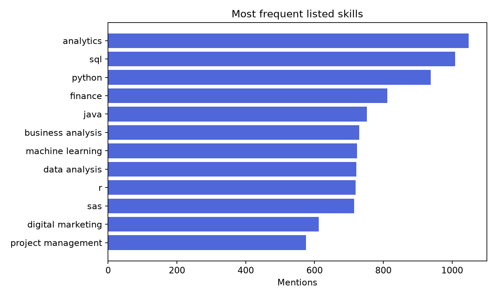
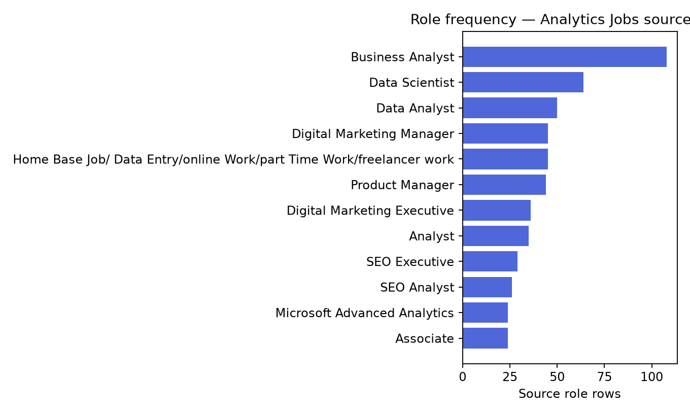
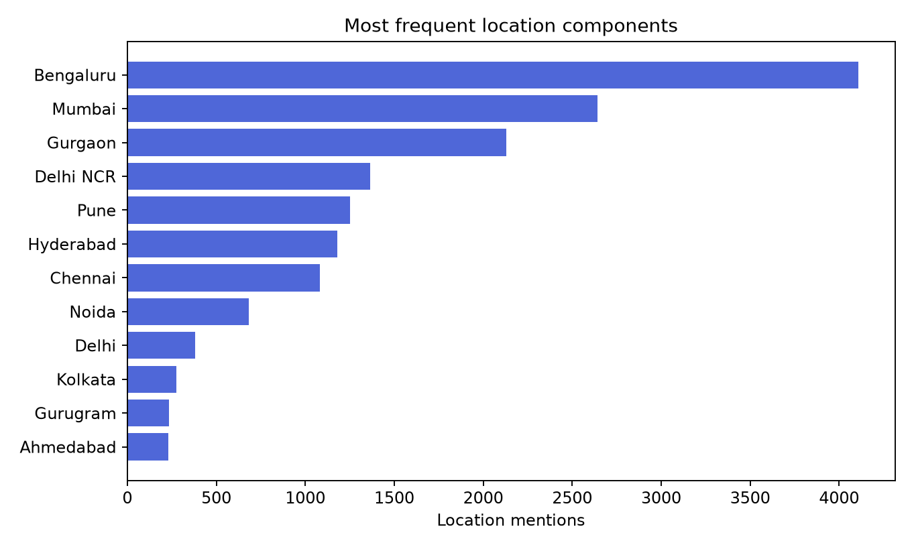
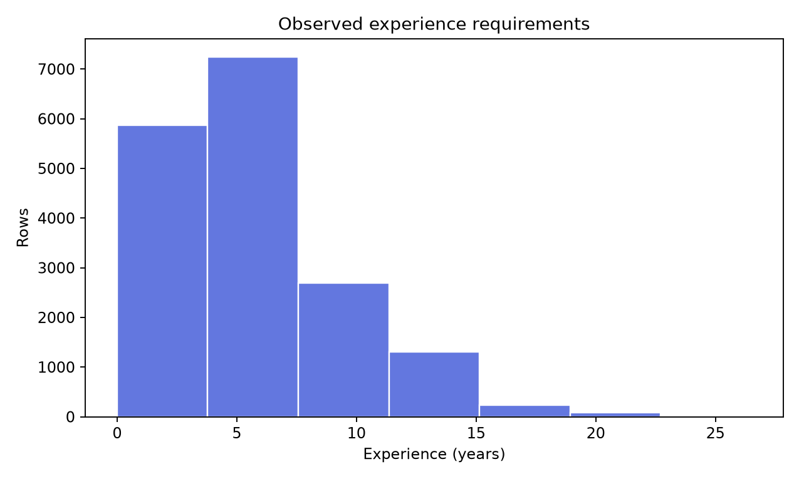
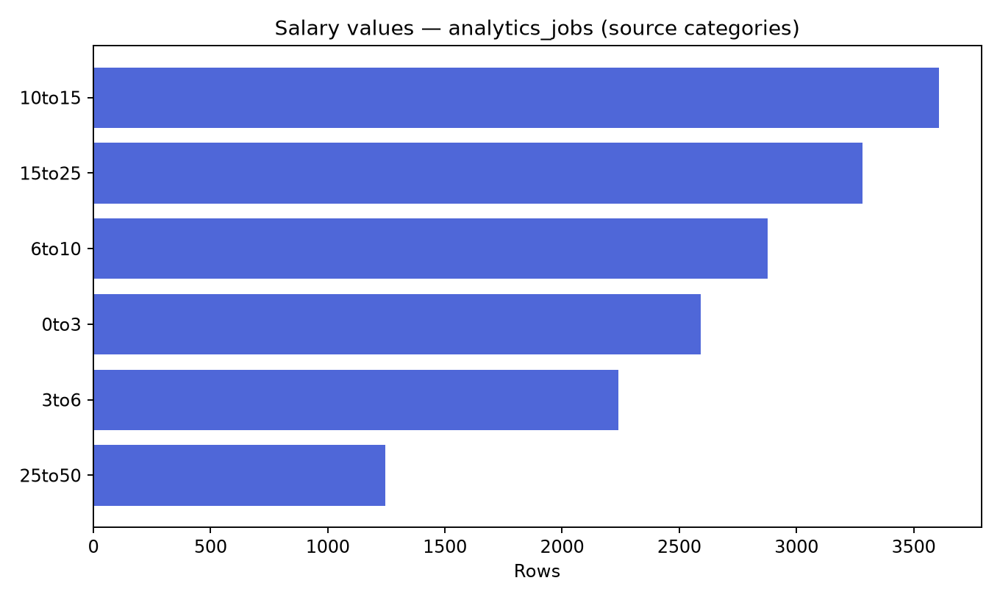
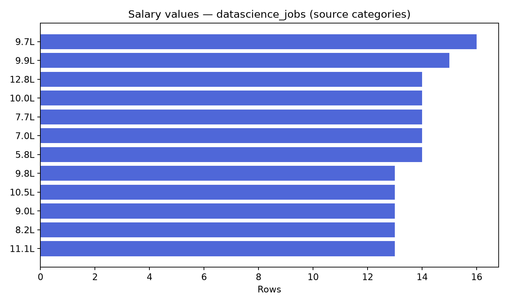

## 9. JDS Modelling Approach

The target column is stored as numeric 0/1. Since the files do not define the mapping, model output remains an encoded class. A majority-class DummyClassifier is compared with logistic regression and random forest. Five-fold shuffled stratified cross-validation is used because both classes have enough cases. Macro precision, recall, F1, accuracy, and ROC-AUC are calculated from out-of-fold predictions. Model choice prioritizes macro F1, with accuracy as a tie-break. The selected model is refit on all complete cases only for the local demo artifact.

Selected model: JDS Logistic Regression; target: `salary_hike_high_or_low`; complete-case rows: 139; stratified folds: 5.

Target interpretation: encoded source target class; the code-to-high/low mapping is undocumented.

Out-of-fold validation metrics:
- accuracy: 0.8345
- precision_macro: 0.8343
- recall_macro: 0.8337
- f1_macro: 0.8340
- roc_auc: 0.8924

Model comparison (macro F1):
- majority_baseline: 0.3443396226415094
- logistic_regression: 0.8339824479410085
- random_forest: 0.8198081410422609

Limitations:
- The target records the supplied salary-hike class and may reflect a narrow sample or a dataset-specific definition.
- Cross-validation is internal to the supplied dataset; it does not establish performance on other organizations or populations.
- Skill scores are observational inputs; associations are not evidence that a skill causes salary growth.
- Cross-validation estimates may be unstable for a small or non-representative sample.

## 10. JDS Results

The exact comparison values are reported below. The selected logistic model's strongest absolute standardized coefficients rank skill associations in this fitted model; absolute magnitudes do not provide direction and are not causal effects.

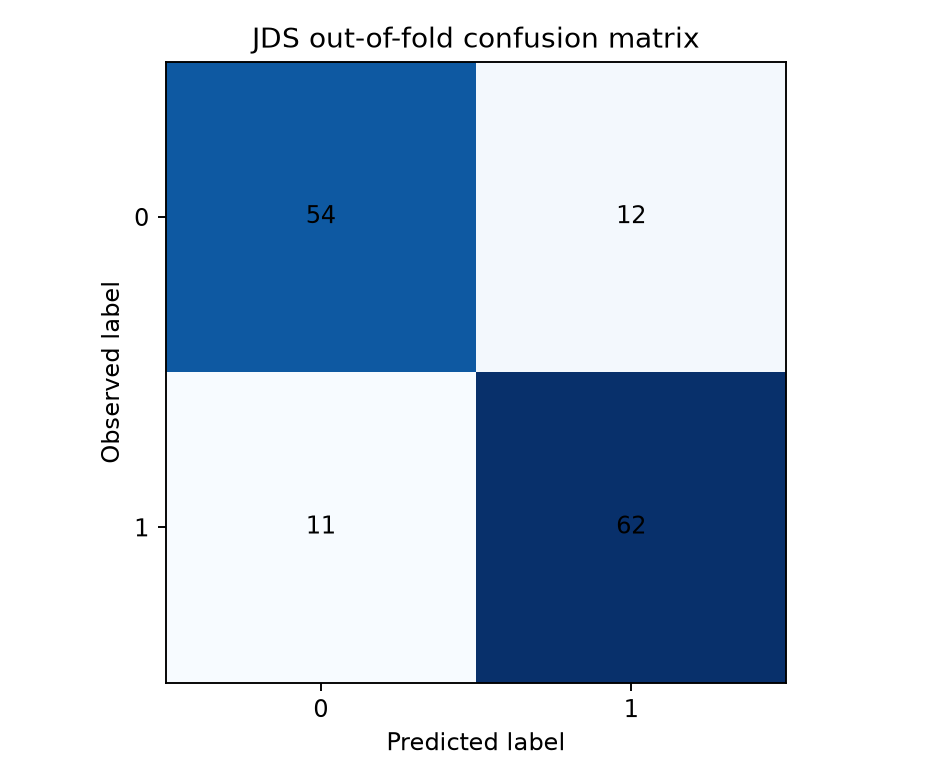
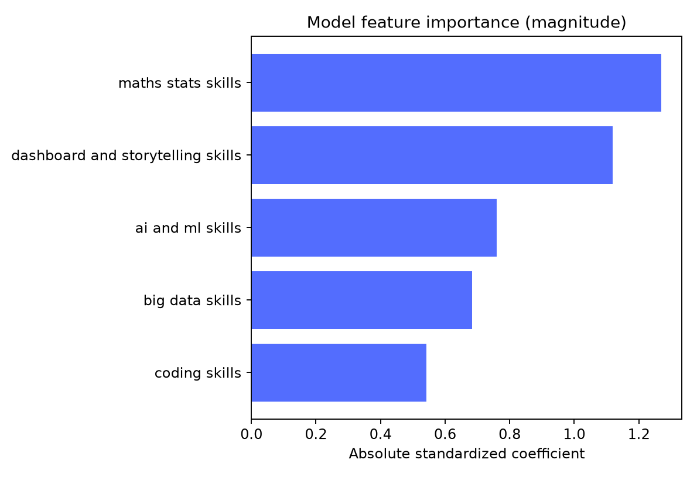
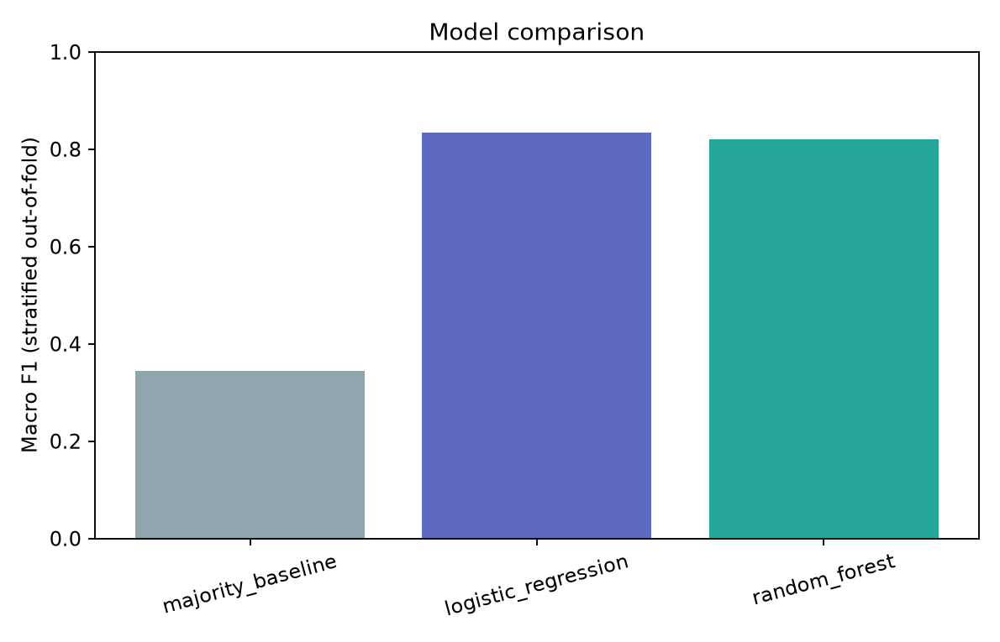

## 11. SDS Modelling Approach

The same baseline and candidate algorithms, fold logic, metrics, and selection rule are applied to the SDS target after normalizing its header. The source target is also encoded 0/1 without an authoritative semantic mapping. Trait values are model inputs because they are present in the supplied sample; this does not validate use in hiring.

Selected model: SDS Random Forest; target: `success_classification_high_low`; complete-case rows: 161; stratified folds: 5.

Target interpretation: encoded organizational success label; association only, not a universal personality-based hiring truth.

Out-of-fold validation metrics:
- accuracy: 0.9565
- precision_macro: 0.9567
- recall_macro: 0.9560
- f1_macro: 0.9564
- roc_auc: 0.9949

Model comparison (macro F1):
- majority_baseline: 0.34552845528455284
- logistic_regression: 0.9061224489795918
- random_forest: 0.9563533557956702

Limitations:
- The target is the success label supplied in this dataset, not universal or independently verified career success.
- Personality-trait associations do not show that personality causes organizational success.
- The model must not be treated as a hiring score or used to make individual employment decisions.
- Cross-validation is internal to the supplied sample and may be unstable for small class counts.
- Cross-validation estimates may be unstable for a small or non-representative sample.

## 12. SDS Results

The random forest's feature-importance values are impurity-based within this fitted model. They describe model reliance in this sample, not causal effects, universal trait validity, or person-level suitability.

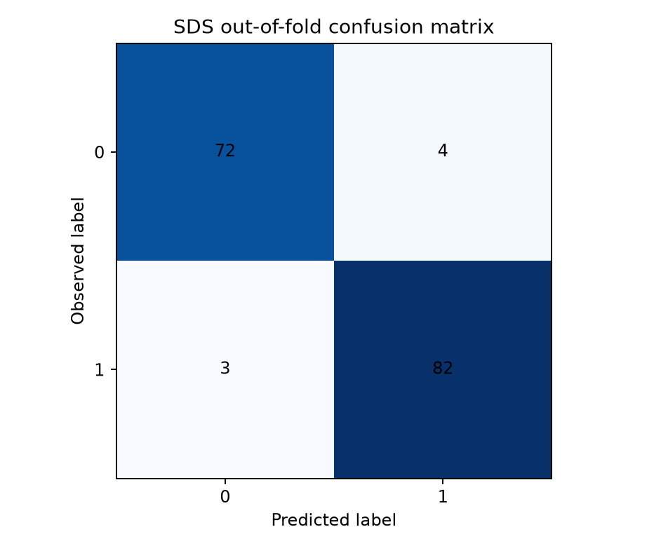
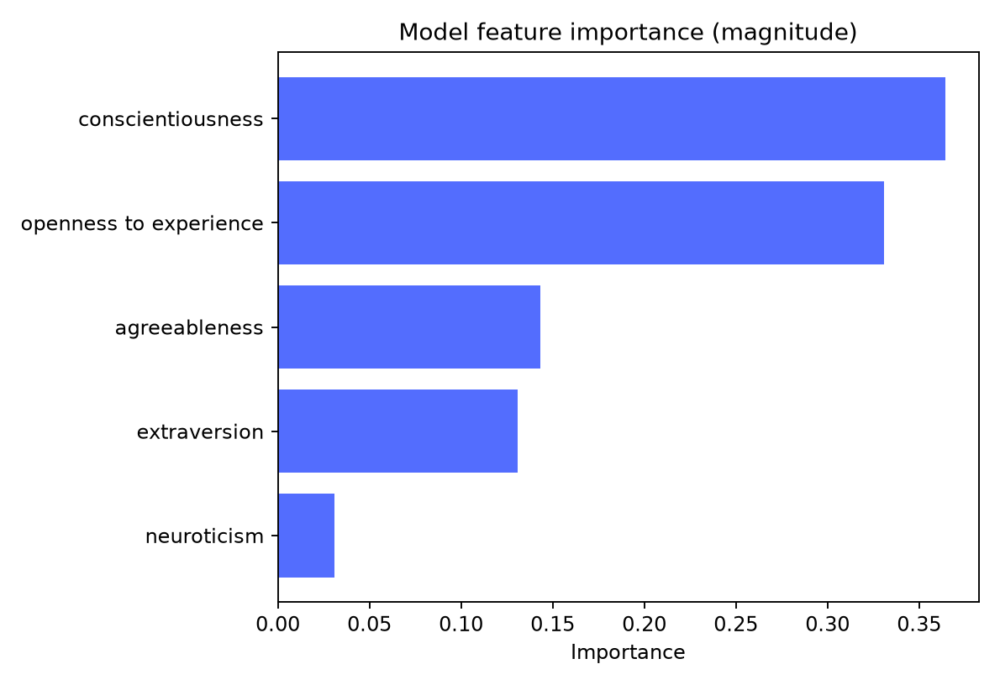
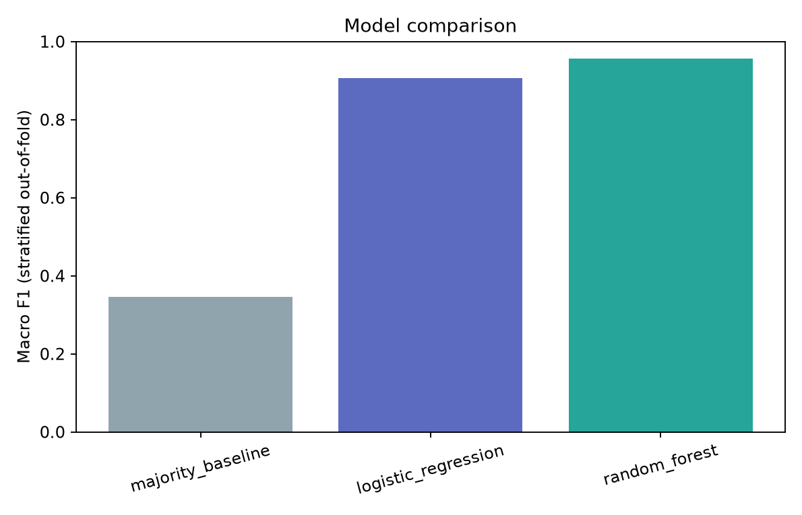

## 13. Cross-Analysis and Consolidation

The job-posting files and traits files contain different units and no documented person/job join key. No record-level merge is performed. Market summaries and label models are therefore presented as complementary but independent evidence, without combining them into a score.

## 14. Key Findings

- analytics is the most frequent normalized skill mention (1,048) in the parsed skill text.
- Business Analyst is the most frequent role label (296 source rows) under the standardized role-field extraction.
- The parsed DataScience salary and minimum-experience fields have a within-source Pearson correlation of 0.593 over 1,602 rows.
- JDS Logistic Regression has five-fold out-of-fold accuracy 0.835 and macro F1 0.834 on 139 rows. This estimate is internal to the supplied sample.
- SDS Random Forest has five-fold out-of-fold accuracy 0.957 and macro F1 0.956 on 161 rows. This estimate is internal to the supplied sample.

## 15. Conclusions

The files support aggregate descriptions of advertised roles, skill mentions, locations, and source-specific salary/experience fields. Both small labeled tables support internally evaluated classifiers with observed numeric class codes, but the class meanings are not confirmed by the available data. Results do not establish that skills cause salary increases or traits cause success. The prototype is an analytical demonstration, not a validated employment decision tool.

## 16. Implications for Stakeholders

Workforce planners can use the job-posting aggregates to frame skill and location discussions while checking source coverage and the posting mix. The JDS classifier can be used to demonstrate local model serving against its encoded target. The SDS analysis should remain a research view only and must not screen, rank, or assess individuals. Any operational proposal requires confirmed label definitions, representative data, external validation, and a separate fairness/privacy review.

## 17. Limitations

- Job postings may not represent the full labor market and can contain duplicates, incomplete fields, or source-specific collection bias.
- Salary units and currencies are not converted; unparseable or ambiguous salary values are excluded from numeric summaries.
- Observed relationships are descriptive associations and do not identify causal effects.
- Column roles are inferred from standardized column names and should be reviewed against the source schema.
- The target records the supplied salary-hike class and may reflect a narrow sample or a dataset-specific definition.
- Cross-validation is internal to the supplied dataset; it does not establish performance on other organizations or populations.
- Skill scores are observational inputs; associations are not evidence that a skill causes salary growth.
- Cross-validation estimates may be unstable for a small or non-representative sample.
- The target is the success label supplied in this dataset, not universal or independently verified career success.
- Personality-trait associations do not show that personality causes organizational success.
- The model must not be treated as a hiring score or used to make individual employment decisions.
- Cross-validation is internal to the supplied sample and may be unstable for small class counts.
- Cross-validation estimates may be unstable for a small or non-representative sample.
- JDS (139 complete cases) and SDS (161 complete cases) are small samples; fold estimates can vary substantially.
- No external holdout or temporal validation was available.
- Target codes 0/1 are not documented here; semantic high/low mapping remains unresolved.
- Potential self-reporting, masking, selection bias, and target-definition issues cannot be quantified from these files alone.
- The job sources may contain truncation, inconsistent category text, and source-specific coverage; salary-band units in Analytics Jobs are not explicit.
- The unweighted or reported count aggregation differs by source; reported job counts are not a deduplicated market total.
- Observational associations do not establish causal effects.

## 18. Future Work

Confirm the target codebook and salary-band units with organizer documentation, evaluate on an independent representative sample, assess temporal and subgroup robustness, review skill extraction and deduplication assumptions, and document feature scales before exposing predictions to users. Keep any SDS result out of individual hiring decisions.

## 19. Appendix References

`data/reports/data_quality_report.md` and `.json`; `data/reports/job_market_report.md`; `model/reports/jds_training.json`; `model/reports/sds_training.json`; `model/artifacts/job_market_summary.json`; and generated figures in `model/figures/`.

## Descriptive Talent Intelligence Workflow

The dashboard provides a separate descriptive profile workflow for six user-entered categories: Python, SQL, Machine Learning, Statistics, Big Data, and Dashboard/Storytelling. Each category is matched against normalized terms in the aggregate `skill_vocabulary`; its frequency is the sum of available mention counts for supported aliases. Skill mention evidence comes from the Analytics Jobs `key_skills` field; DataScience Jobs has no extracted skill field. The overlap percentage is the number of selected profile categories with at least one supported vocabulary term divided by the number selected. It describes vocabulary coverage only; it is not a model output, candidate fit score, employment probability, or person ranking.

The workflow lists high-frequency skill terms among the ten most-mentioned terms that were not represented by the selected profile. It also surfaces up to five role labels using explicit analyst-authored role-to-skill rules. Role frequencies come from the supplied role aggregates. The sources cannot show that a skill occurs within a particular role because the job files have different aggregation structures and no row-level join key. The UI discloses this beside the results, and the endpoint does not read or expose raw rows.

## Interpretation of model comparisons

The majority-class baseline is included to show performance available from predicting only the most common class. Macro precision, recall, and F1 weight the two encoded classes equally, which is relevant because class counts are similar but not identical. ROC-AUC is calculated from out-of-fold probabilities for the non-baseline estimators. The reported confusion matrices summarize out-of-fold hard predictions. None of these metrics establishes performance on future data, other institutions, or a new population.

The SDS metrics in particular should be read cautiously: its unusually strong separation on 161 supplied rows could be sample-specific or related to how the source label and traits were constructed. The available files do not support a finding about independent job performance. Replication with a documented target and independent, representative data is necessary before broader claims.

## Artifact and API boundaries

The pipeline creates aggregate JSON, model metadata, locally serialized model artifacts, and figures. The API validates metadata against its integration contract and never provides source rows. `/api/talent/profile` consumes the aggregate skill vocabulary and role summary only; `/api/models/{jds|sds}/predict` serves the locally trained model artifacts. Prediction forms label values as demo-entered and validate them against observed training ranges. The source code 0/1 mapping remains unchanged end to end.

Raw organizer datasets and row-level processed files remain local and are ignored by Git. The prototype has no runtime external AI API or remote frontend dependency. For a demo, bind the server to localhost and use only aggregate views.

## Generated artifact references

Data audit: `data/reports/data_quality_report.md` and `.json`. Job-market analysis: `data/reports/job_market_report.md` and `model/artifacts/job_market_summary.json`. Model runs: `model/reports/jds_training.json`, `model/reports/sds_training.json`, and metadata in `model/artifacts/`. Evaluation and market charts: `model/figures/`. API contract: `API_CONTRACT.md`. Demo: `docs/DEMO_SCRIPT.md`. Presentation: `docs/PRESENTATION_OUTLINE.md`.